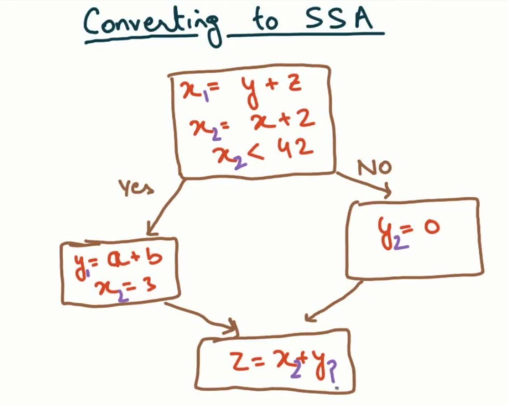
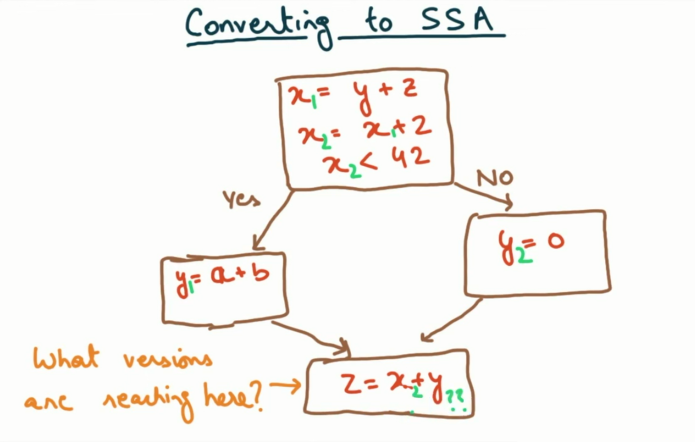

# Exercise 2: Understanding SSA (Static Single Assignment)

What is SSA?
In LLVM and in general IR, every variable is assigned exactly once. This is called Static Single Assignment (SSA) form.

That means:

- You **cannot reassign** a variable after it’s set.
- Instead, you create **new variables** for each updated value.

Here’s an example in SSA style:
```
x1 = y + z
a = b + x1
x2 = a + 3
y = x2 - a
```
**Note**:
- Even though `x1` and `x2` both refer to a version of `x`, they are treated as **separate variables** in SSA.
- Every name on the left-hand side of an assignment is **unique**.

### Why does LLVM use SSA?

SSA makes it easier for compilers to:
- Track where values come from
- Perform optimizations like constant folding and dead code elimination
- Analyze data flow without ambiguity (we call this control flow)


## Question:

Lets look at this below.



We cannot answer this without knowing

## Basic Blocks:

A basic block is a maximal sequence of instructions with
- cannot jump into a basic block (except at the beginning)
- cannot jump out of a basic block (except at the end)
- single-entry, single-exit

This just means nobody should be able to jump to middle of a basic block.

Using this knowledge, lets look back again now. We want to know if the final basic block is `z` is `=` to `y1` or `y2`


